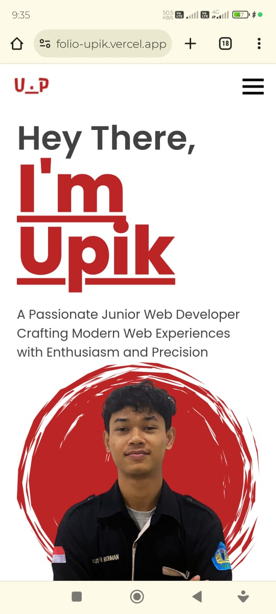

# Portofolio Upik
Selamat datang di portofolio saya! Berikut adalah 

## Fitur-Fitur
### Beranda(logo)
- Perkenalan singkat tentang saya, Lutfi Nur Rohman, seorang pengembang web junior.
### About Me
- Biografi pribadi yang mencakup latar belakang pendidikan dan pengalaman kerja saya.
- Minat pribadi di luar pekerjaan.
### Experience
- Pengalaman kerja saya, termasuk posisi, tanggung jawab, dan prestasi yang telah dicapai.
- Detail peran saya dalam berbagai organisasi.
### Education
- Riwayat pendidikan dan pelatihan saya, termasuk institusi dan jurusan yang diambil.
### Keterampilan
- Daftar keterampilan teknis yang saya kuasai, seperti HTML, CSS, JavaScript, dan lain-lain.
- Penambahan efek hover pada ikon keterampilan.
### Proyek
- Galeri proyek web development yang telah saya kerjakan, lengkap dengan tautan ke demo langsung.
- Penambahan fitur slide untuk navigasi proyek.
### Kontak
- Informasi kontak saya termasuk lokasi, nomor telepon, email, dan tautan ke akun GitHub.
### Kontak
- Email: lutfinurrohman5@gmail.com
- GitHub: LutfiNR

## Cara Menggunakan
### Beranda:
- Baca perkenalan singkat tentang saya di bagian kiri.
- Lihat gambar profil saya di bagian kanan.
### Tentang:
- Baca biografi dan minat pribadi saya.
### Pengalaman:
- Telusuri pengalaman kerja, prestasi, dan partisipasi organisasi saya.
### Pendidikan:
- Cek riwayat pendidikan dan pelatihan saya.
### Keterampilan:
- Lihat daftar keterampilan teknis yang saya kuasai.
- Nikmati efek hover pada ikon keterampilan.
### Proyek:
- Jelajahi galeri proyek saya dengan fitur slide untuk navigasi yang mudah.
- Klik tautan untuk melihat demo langsung proyek.
### Kontak:
- Dapatkan informasi kontak saya termasuk email dan GitHub.

## Dokumentasi
- Desktop

- Mobile

